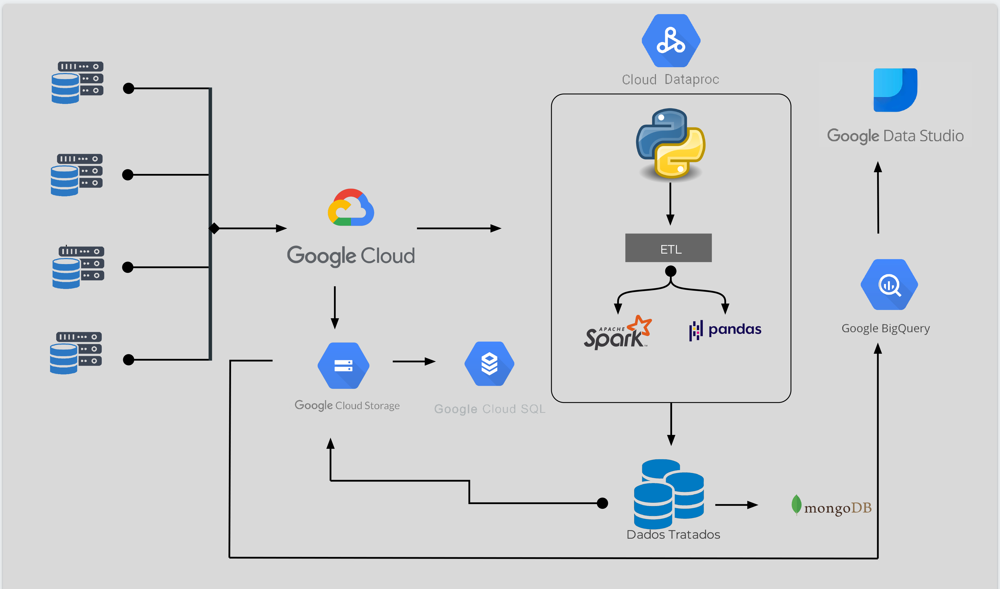

# Projeto-de-Conclusao-de-Curso---SoulCode

## Projeto final do curso Engenharia de Dados da SoulCode Academy.

### Tecnologias utilizadas para realização do projeto:
- Google Cloud Platform (CGP)
- Cloud Storage
- Dataproc
- DataStudio
- BigQuery
- Python
- Pandas
- PySpark
- SparkSQL
- Apache Beam
- MongoDB

## Desafios do projeto:

Nos foi dado o desafio de comparar custos de vida de cidades ou países , então optamos por fazer uma comparação entre a cidade do Rio de janeiro e a de São Paulo. A análise feita foi do ano de 2011 a 2021, e para isso utilizamos as seguintes fontes de dados:
-ANP (Agência Nacional do Petróleo) - Combustível,
-ANP (Agência Nacional do Petróleo) - GLP P13(gás de cozinha),
-IPEADATA - Salário minimo,
-DIEESE (Departamento Intersindical de Estatística e Estudos Socioeconômicos) - Cesta Básica.

## Descrição
- Todas as equipes deverão entregar as mesmas especificações, de acordo com o seu respectivo tema.
- Vocês deverão aplicar os conceitos vistos durante o curso para tratar, organizar e modelar os dados de no mínimo 2 datasets escolhidos por vocês seguindo o tema de sua equipe.
- Obrigatoriamente deverá conter as tecnologias Google Cloud Platform(Cloud Storage), Python, Pandas, PySpark, SparkSQL, Apache Beam*, Data Studio, Big Query e MongoDB.

## Apresentação

A apresentação do trabalho se dará da seguinte maneira:

- Cada grupo deverá ser totalmente responsável pela forma pela qual vai interpretar o dataset, apresentando suposições e conclusões dos dados. Todas essas situações devem ser explicadas.
- Deverá iniciar pela apresentação do dataset, informando de qual local foi baixado o dataset e quais as principais informações sobre o mesmo.
- Deverá apresentar as funções e ferramentas utilizadas no código.
- Explicar o porquê do dataset escolhido.
- Todos os componentes deverão se apresentar.
- Deverá ser usado termos técnicos, evitando o uso de gírias ou expressões coloquiais e/ou culturais.
- Cada grupo terá até 60 minutos para se apresentar.
- A ordem da apresentação será comunicada pelos professores próximo à data de apresentação.

## Principais Habilidades a serem avaliadas
- Oralidade e comunicação em público.
- Capacidade de argumentação
- Habilidade de codificação em Python e utilização de suas bibliotecas
- Habilidade de interpretação e análise de dados.
- Capacidade de implementação de códigos utilizando as bibliotecas Pandas e PySpark.
- Capacidade de implementação de consultas utilizando a linguagem SQL.
- Capacidade Analítica e Interpretativa.
- Capacidade de organização e grupo

## REQUISITOS OBRIGATÓRIOS
- Obrigatoriamente os datasets devem ter formatos diferentes (CSV / Json / Parquet / Sql / NoSql) e 1 deles obrigatoriamente tem que ser em CSV.
- Operações com Pandas (limpezas , transformações e normalizações) 
- Operações usando PySpark com a descrição de cada uma das operações.
- Operações utilizando o SparkSQL com a descrição de cada umas das operações.
- Os datasets utilizados podem ser em lingua estrangeira , mas devem ao final terem seus dados/colunas exibidos na lingua PT-BR
- os datasets devem ser salvos e operados em armazenamento cloud obrigatoriamente dentro da plataforma GCP (não pode ser usado Google drive ou armazenamento alheio ao google)
- Os dados tratados devem ser armazenados também em GCP, mas obrigatoriamente em um datalake(Gstorage ) , DW(BigQuery) ou em ambos.
- Os datasets originais devem ser armazenados em MySql
- Os Dataframe(s) resultante(s) deve(m) estar em uma coleção do mongoDb atlas (informar a key de acesso ao cluster) e preferencialmente criar o usuario (soulcode) e senha (a1b2c3) no cluster
- Deve ser feito análises dentro do Big Query utilizando a linguagem padrão SQL com a descrição das consultas feitas.
- Deve ser criado no datastudio um dashboard para exibição gráfica dos dados tratados trazendo insights importantes
- E deve ser demonstrado em um workflow simples (gráfico) as etapas de ETL com suas respectivas ferramentas.

## REQUISITOS DESEJÁVEIS
- Utilizar o dataflow com algum modelo pré-definido
- Criar plotagens usando pandas para alguns insights durante o processo de Transformação 
- Montar um relatório completo com os insights que justificam todo o processo de ETL utilizado
- Implementar ingestão de dados e transformações por meio de uma PIPELINE com modelo criado em apache beam usando o dataflow para o work
- Por meio de uma PIPELINE fazer o carregamento dos dados normalizados diretamente para um DW ou DataLake ou ambos
- Levantar custos com a utilização do google cloud no período do projeto e possíveis otimizações de custo

